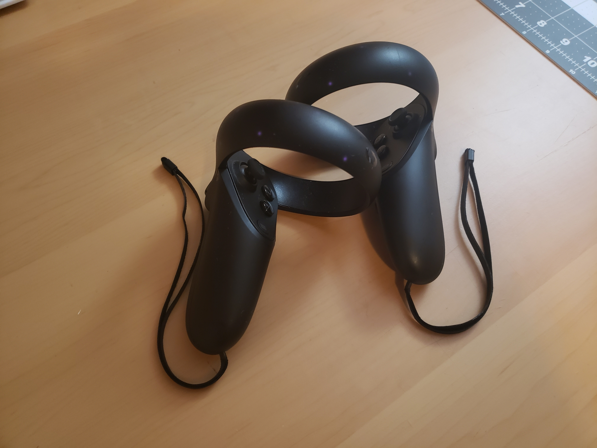
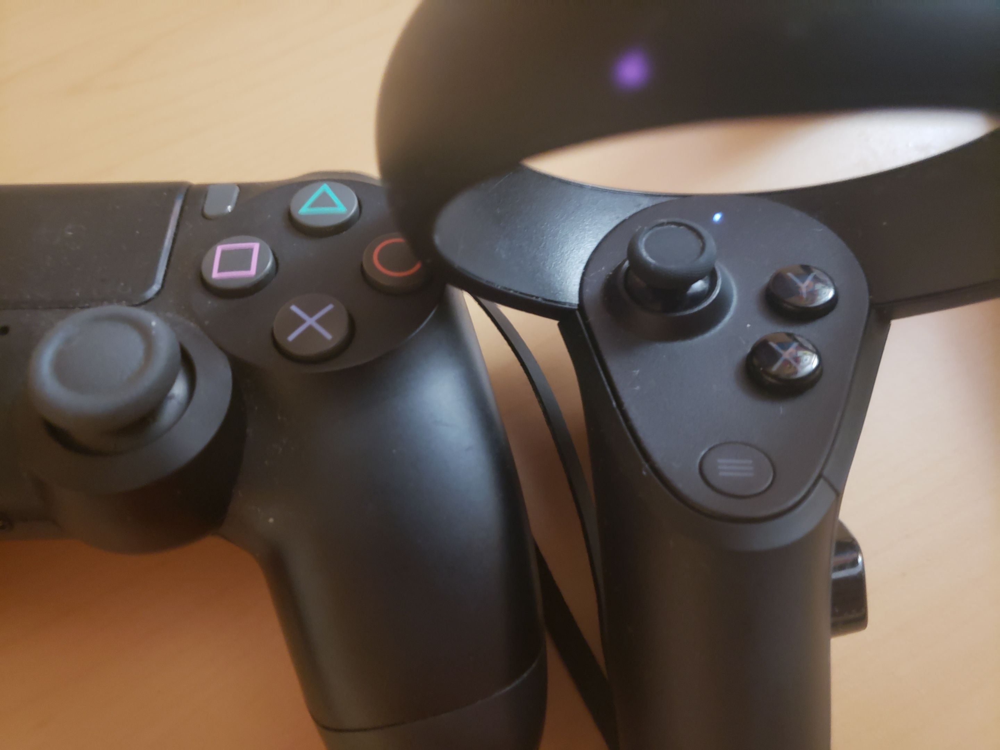
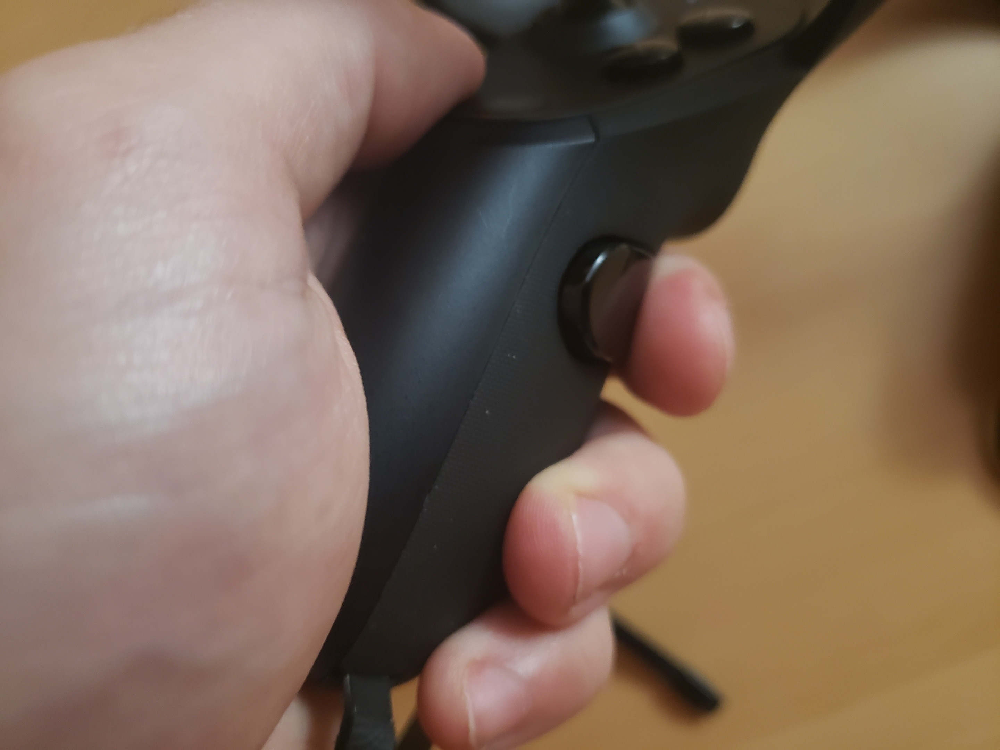
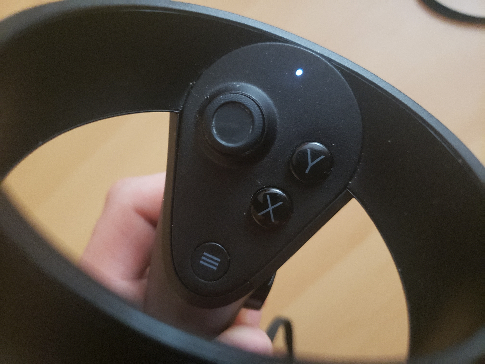
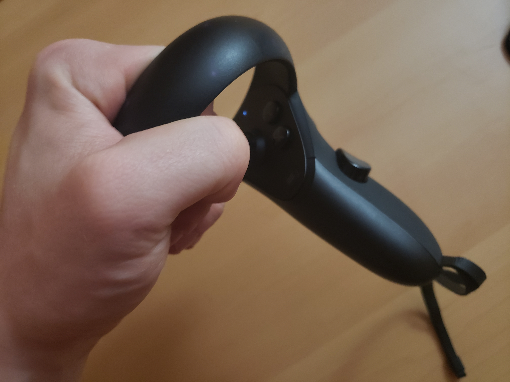

# Oculus's Touch Controllers - A New Dimension for Usability
**By Tom Shelton (2/18/2022)**
***

** Terms highlighted in bold are defined at the bottom of this page.**

Oculus, (Now Meta) set out to solve a very hard problem: "How do people interact in a virtual reality environment?" This has proven to be a multi-faceted issue, as there are multiple ways one interacts with their environment, be it through direct physical touch, locomotion, or instigating certain events, like dialogue. Their product, the Oculus Touch Controller, set out with a flurry of competitors to provide consumers with a solution and consistent **PARADIGM** for VR operation, and arrived at a product with plenty of positives, but plenty of negatives as well.

In my experience, the Oculus Touch controller is **MEMORABLE** if you've ever used an XBOX or Playstation controller in your life. The layout of buttons roughly mimics one of these, broken in half to be more useful for ambidextrous interaction with the environment. The design of a traditional controller is being utilized as a sort of **METAPHOR** for this new mode of interaction. 

I find the **INTERACTION TYPE** I use these controllers the most for is **EXPLORING**, however buttons will typically augment their functionality. Buttons may enable different modes of **MANIPULATION**, or enable/disable microphones used for **CONVERSING**. They may also bring up helpful assistants or menus in order to **INSTRUCT** the system (say to switch games.)

Since the controller is not able to accurately track each individual finger, and there is high demand for being able to grip certain objects in a virtual space, Oculus has implemented the "grip" button. This fulfills the criteria of **NATURAL MAPPING**, as they have determined the user's typical hand position, and tried to understand the most natural and logical place to put a button so that people do not need to think about what they are doing to grip an object. I do not even consider when I need to grip an object, and feel that they have been majorly successful with the button's inclusion.

However, I also have complaints about the Touch controller, as it is not as **LEARNABLE** without explicit direction either from a demonstrator, or software. While the button layout is familiar to a lot of users, in my experience I have found that many are not expecting to use anything resembling an XBOX controller, and struggle to locate certain buttons on the "gamepad" portion (the circular buttons arranged in a diagonal shape that are typically under the user's thumb.) I would go as far as to say they are not intuitive. 

Compared to the gripping functionality of the controller, the gamepad lacks a sort of natural mapping, and each button's similarity to the other prevents them from feeling unique. The other challenge is that the user must usually take the headset off to determine which is which. Perhaps making these buttons different tactile shapes would allow them to more readily find them, although it may be a compromise on the company's strict aesthetic standards. An alternative would be to have only one single thumb-button, although this would be limiting, as many games require multiple.

I also have complaints about the "loop" design of the controllers, which house the infra-red LEDs that help the controllers orient themselves in relation to the VR Headset. Many users find the loops **AFFORD** grasping when they are picking up the controllers while wearing a headset, and this **AFFORDANCE** is much stronger than the area actually meant for holding the controller idly. Controllers are also hand-specific, and users will often mix up the left and right controller immediately after realizing they are holding the device wrong. The big challenge here is that users tend to act on these devices while visual contact is minimal, and rely on tactile cues that are simply not there.

Some users may be quick to ask, "Why can't we use gesture tracking for everything? That would be intuitive!" I feel that Oculus HAS made the right decision by going with physical controllers, as locomotion, or other **INTERACTION TYPES** are painful to switch between when there is no physical reference item for your hand to rely on. The physicality of the controller makes actions a binary, rather than an analogue: ("The user has pressed the physical jump button" versus "The user is 80% likely to be making the jump gesture.")

With the goal of interacting with a virtual-reality environment, the experience of fumbling with **LEARNABILITY** and **MAPPING** issues, and the outcome of frustration and feeling heavy-handed in-game, I am disappointed with the Touch controllers compared to competitors. I still think that the company can remedy these issues, although it will take additional R&D resources. 

All in all, I appreciate the thought has gone into this product design, and given its release during the early years of virtual reality, I can understand that it was a hard design to get out the door. However, I feel that it is time for the company to revise their controller setup, lest its in**EFFICIENT** design become the new default for virtual controller interfaces.

- Tom

### Terms Used

+ **MEMORABLE** - How quickly users are able to remember a component of a process.
+ **AFFORDANCE/AFFORD** - Describes the relationship between an object and its function.
+ **METAPHOR** - Aids in users building solid conceptual models based on that which is already familiar.
+ **INTERACTION TYPE** - Comprised of Exploring, Conversing, Instructing and Manipulating.
+ **CONVERSING** - A user's natural-language interaction with a system.
+ **INSTRUCTING** - A user's direct control over a system based on certain needs ("I need to print; I need to mail.")
+ **MANIPULATING** - A user interacting with real or virtual objects, such as zooming or minimizing.
+ **EXPLORING** - A user moving through a virtual environment.
+ **PARADIGM** - Like that of the GUI or WIMP Interface, a set of interaction practices agreed upon by a community.
+ **LEARNABLE** - Ability for a user to learn a certain process.
+ **NATURAL MAPPING** - Where elements of an interface are positioned relative to cultural or biologically driven expectations.
+ **EFFICIENCY** - Rate at which a process can be accomplished.

