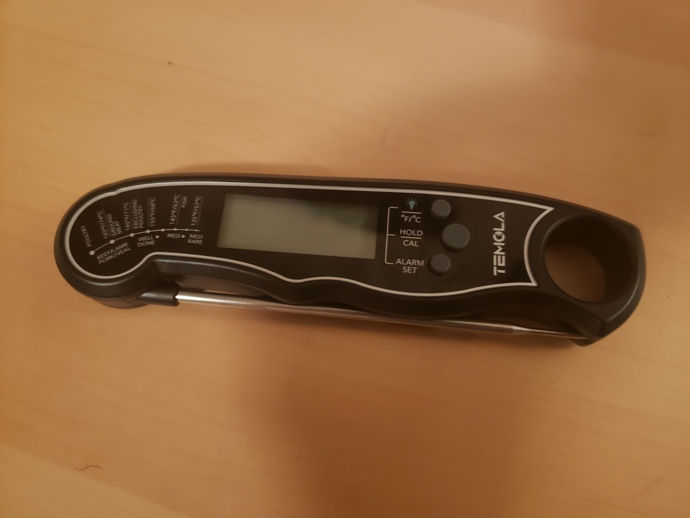
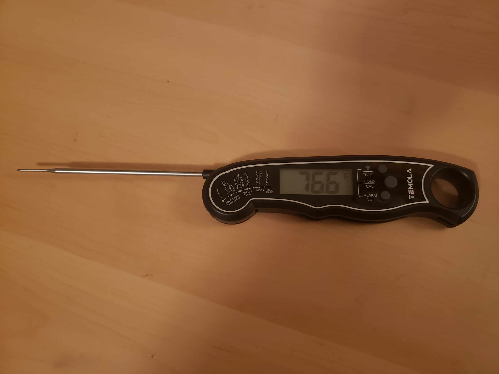

# Temola Digital Oven Probe & Meat Thermometer - Fun Until You Poke Yourself
**By Tom Shelton (3/29/2022)**
***

**Terms highlighted in bold are defined at the bottom of this page.**

The Temola digital oven probe is one of those devices that is simultaneously a blessing and a chaotic mess to use. Where other meat thermometers in the oven probe category have opted for a less portable, boxier shape, Temola has chosen to resemble something of a futuristic kitchen tool, ergonomically (as it is to be believed) designed to **AFFORD** manipulation by the hand with its many ridges and bumps. The tool's goal is to give you two ways to measure the temperature of your meat, either by folding out an integrated prong for directly measuring the temperature of meats, or by using the long, remote cable prong that can sit inside of a burning-hot oven.

While it is accurate, users may be disappointed once they remove the thermometer from its packaging and attempt to mess with the buttons. The Temola does not seem to trust users to turn it on and off via any buttons or switches, and attempts to handle this in an "intelligent" manner by sensing when one of the two prongs are either folded out or connected. This does prevent battery drain if you use the fold-out prong primarily, but not if you're the sort to leave the cable prong connected. **LEARNABILITY** suffers here, and while there is not much to memorize, the design leaves one longing for a quick button press so that they can set a target temperature without a massive spike sticking out of the device.

Interesting to note, the Temola places **CONSTRAINTS** on certain potential **AFFORDANCES**, making the hole at the bottom of the device just large enough to hang up on a hook, but not large enough for the human hand to do much with it. This prevents some confusion as to how someone is supposed to use it.

The Temola fails a major usability category with **SAFETY**, as its calibration feature is quite easy to accidentally enable. By pressing the middle-most button and holding, the interestingly named "CAL" function springs to life, recalibrating the thermometer with the assumption that you have read the manual and are now submersing the entire thing within a glass of ice water. Of course, you can always cancel this operation, but this requires that you either quickly fold the prong (which could be covered in meat or glowing inside of your oven.) This ability to adjust the baseline from which the thermometer operates means that it is easy to ruin your reading, and thus end up with food poisoning, or burnt, meat-covered hands at the very best.

Setting the target temperature is also a confusing ordeal. Once a user has pressed the "ALARM SET" button, it may be uncertain how to move the temperature up and down. My initial interaction with this was that I learned how to turn down the target temperature, but never to increase it. Every time I wanted a higher target temperature, I would turn the device off, and then decrease the temperature, hoping that I did not overshoot. The issue here is that the increase and decrease button lack the **NATURAL MAPPING** (or even labels) to make it obvious which buttons do what. My **MENTAL MODEL** of how this device should operate is confused by buttons that are both functional (hold temperature, change measurement system, activate light) and modal (enter alarm-setting mode, calibrate.)

Speaking of **NATURAL MAPPING**, the temperature chart on the front of the device seems to indicate some physical relationship between the curvature of the device and the labels. My first assumption without reading the content was that it was some indicator of how far to insert the probe into certain kinds of meat. The "timeline" design may not be the best choice here.

Overall, it works after reading the manual, and there are some neat features, but I am confused at how a display that only really needs to move a number up or down could become so over-complicated. Calibration is definitely not on the same importance level as setting the target temperature, and the measurement system used could very well be a switch on the back. A simple display with a plus and a minus would be enough to take care of most users' needs, and foregoing the wellness chart would mean less visual clutter.

- Tom

### Terms Used

+ **AFFORDANCE/AFFORDS** - Describes the relationship between an object and its function.
+ **CONSTRAINTS** - Limiting factors of something that shapes its affordances.
+ **LEARNABILITY** - Ability for a user to learn a certain process.
+ **MENTAL MODEL** - A user's understanding of how a system should operate.
+ **NATURAL MAPPING** - Where elements of an interface are positioned relative to cultural, biological or physically driven expectations.
+ **SAFETY** - Ability for a user to stay safe while interacting with something.

