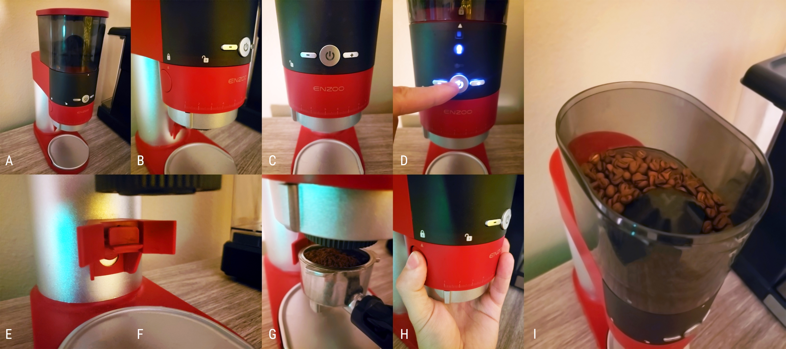

# Enzoo Coffee and Espresso Grinder

**By Thomas Shelton, (5/16/2022)**
***

**Terms highlighted in bold are defined at the bottom of this page.**

I bought the Enzoo Coffee and Espresso Grinder when I was on a "do-it-at-home" espresso kick. It seemed like it would be fun to do everything from the grinding to the brewing at home, and this machine was the first step in that process. My goals with this device were to grind the coffee to a fine enough level that they would work properly in an espresso machine. Not all coffee grinders can do this, given that not everyone needs that fine of a powder.

My interaction began by surveying the entire device (photo A), a tall, skinny device in shades of red, black and silver. My **MENTAL MODEL** of this machine was influenced by my idea of how it should function, given gravity and the "spout" from which the ground coffee comes out of. The **LEARNABILITY** of this device is high, as from this mental model I intuited that the top section was for storing the coffee (photo I), which would be pulled by gravity down toward the spout area.

The coffee bean storage area (or the "Hopper") also prevents users from mistakenly dropping large objects into the grinder through the **CONSTRAINTS** brought about by the shape of the exit that leads from the hopper to the grinder (photo I).

The user experience during assembly is troubling. Although the "lock" and "unlock" **SIGNIFIERS** (photo B) icon beneath the power button follow some kind of **NATURAL MAPPING** to demonstrate how to attach the grinder and spout, there is a definite lack of FEEDBACK while twisting it on. The user must make sure they are inserting the attachment correctly solely by trying over and over again until they get it right. This made me feel like the product was broken at first, and caused frustration. On top of this, the user must be pushing the button in (photo H) for the entire duration of the installation process.

Many other coffee grinders on the market have an assortment of buttons, but the Enzoo keeps it simple with a large power button, as well as a plus or minus (photo C). Pushing this button (photo D) lights up the front panel, providing good **FEEDBACK**. The unfortunate side of this process is that the user must push the power button again to dispense coffee (if the portafilter attachment is not installed {photo F} ). One would think that pressing this button again would turn the machine off, especially given the "power" symbol, but it instead begins to dispense coffee all over the plate below for whatever interval was entered into the machine through the plus or minus buttons.

I am more familiar using this product with the portafilter attachment (photo F), which allows you to push the portafilter against a lever that activates the machine until removed (photo G). 

- Tom

### Terms Used:

+ **MENTAL MODEL:** A user’s understanding of how a system should operate.
+ **NATURAL MAPPING:** Where elements of an interface are positioned relative to cultural, biological or physically driven expectations.
+ **LEARNABILITY:** Ability for a user to learn a certain process.
+ **FEEDBACK:** A system's ability to communicate to a user that user input was successful.
+ **SIGNIFIER:** Overt instruction, like "Push."
+ **CONSTRAINTS:** Limiting factors of something that shapes its affordances.